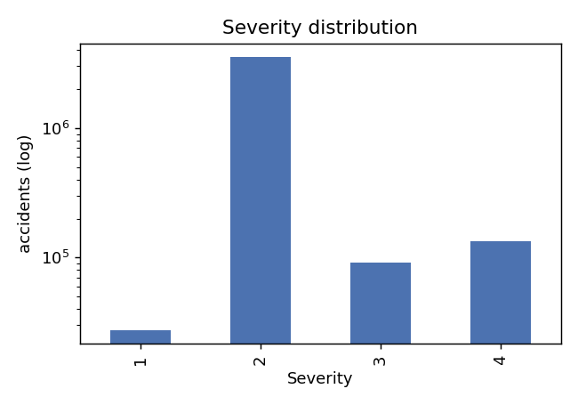
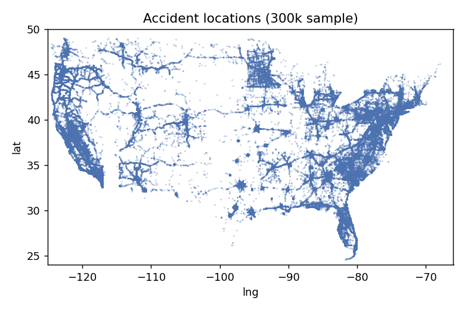
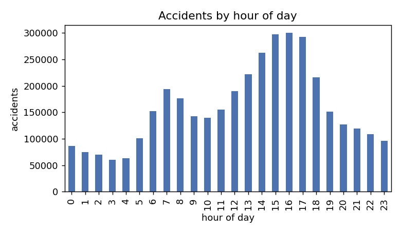
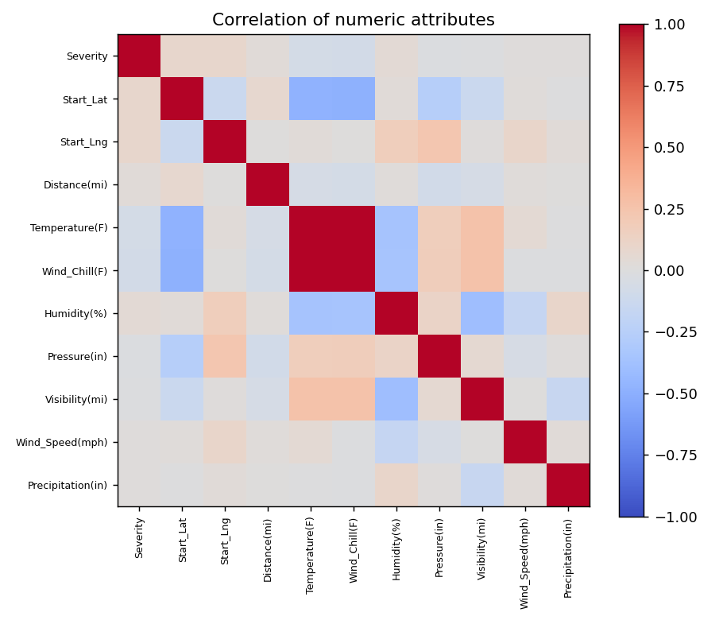

# Knowledge Discovery from US Accidents Data — Project Report

## Part I: Data Exploration and Preprocessing

Code for basic preprocessing: [`preprocess.py`](preprocess.py). All numbers below were computed from the raw file (row filter, missing-value counts) or from the filtered file (`US_Accidents_filtered.csv`, everything else).

### I.1 Data Description and Exploration

**Domain and size.** The US Accidents dataset is a countrywide collection of car accidents (traffic incidents) in the contiguous US, February 2016 – March 2023, gathered from traffic-incident feeds. The raw file has **7,728,394 records and 46 attributes** (3.06 GB). Each record describes one accident: severity, start/end time, location (coordinates, street, city, county, state, zip, timezone), weather at the nearest station, nearby points of interest (POI flags such as `Crossing`, `Junction`, `Traffic_Signal`), and day/night indicators.

**Attribute types (raw):**

| Kind | Attributes |
|---|---|
| Identifier / provenance | `ID`, `Source` |
| Target | `Severity` (1–4; ordinal, describes impact on traffic, 1 = short delay, 4 = long delay) |
| Time | `Start_Time`, `End_Time`, `Weather_Timestamp` |
| Location | `Start_Lat/Lng`, `End_Lat/Lng`, `Street`, `City`, `County`, `State`, `Zipcode`, `Country`, `Timezone`, `Airport_Code` |
| Numeric | `Distance(mi)`, `Temperature(F)`, `Wind_Chill(F)`, `Humidity(%)`, `Pressure(in)`, `Visibility(mi)`, `Wind_Speed(mph)`, `Precipitation(in)` |
| Categorical | `Wind_Direction`, `Weather_Condition`, `Sunrise_Sunset`, `Civil/Nautical/Astronomical_Twilight` |
| Boolean POI flags (13) | `Amenity`, `Bump`, `Crossing`, `Give_Way`, `Junction`, `No_Exit`, `Railway`, `Roundabout`, `Station`, `Stop`, `Traffic_Calming`, `Traffic_Signal`, `Turning_Loop` |
| Free text | `Description` |

**Missing values (raw).** Number of missing values per record: 0 → 3,554,549; 1 → 244,702; 2 → 1,943,062; 3 → 511,801; 4 → 1,011,403; up to 18 for a few records. The main culprit is `End_Lat`/`End_Lng` (3,402,762 missing each, always together, so every record lacking them already has ≥ 2 missing values). Other heavy hitters: `Precipitation(in)` 2.20 M, `Wind_Chill(F)` 2.00 M, `Wind_Speed(mph)` 571 k, and 120–177 k each for the other weather fields. As required, the project dataset keeps only records with **at most one** missing value: 3,554,549 + 244,702 = **3,799,251 records**, exactly the count given in the assignment.

**Missing values (kept data).** Because each kept record has at most one missing value, the missing values are spread over disjoint records (their sum is exactly 244,702):

| Attribute | Missing | % of kept |
|---|---|---|
| `Precipitation(in)` | 177,065 | 4.66 |
| `Wind_Chill(F)` | 34,816 | 0.92 |
| `Visibility(mi)` | 9,846 | 0.26 |
| `Street` | 8,328 | 0.22 |
| `Weather_Condition` | 6,926 | 0.18 |
| `Humidity(%)` | 5,461 | 0.14 |
| `Pressure(in)` | 2,245 | 0.06 |
| `Wind_Direction` | 15 | ~0 |

**Target distribution.** `Severity` is extremely imbalanced, and the filter made it more so:

| Severity | Raw data | Kept data (3.80 M) |
|---|---|---|
| 1 | 67,366 (0.87 %) | 27,671 (0.73 %) |
| 2 | 6,156,981 (79.67 %) | 3,545,535 (93.32 %) |
| 3 | 1,299,337 (16.81 %) | 92,025 (2.42 %) |
| 4 | 204,710 (2.65 %) | 134,020 (3.53 %) |

A majority-class classifier will therefore already reach ~93 % accuracy; accuracy alone will be a poor measure and per-class precision/recall/F1 will matter (Part II).

#### Salient observations

* **The row filter is not random.** Severity 3 drops from 16.8 % to 2.4 % of the data while severity 2 rises from 79.7 % to 93.3 %. Records that survive are essentially those that have end coordinates and full weather; whatever mechanism produced the missing `End_Lat/Lng` is strongly associated with severity. Conclusions drawn from this subset describe *this* subset, not all US accidents (relevant for the "estimated accuracy over the entire domain" questions in Parts II.2 and III.2).
* **Coverage grows over time.** Accidents per year in the kept data: 2016: 23 k, 2017: 42 k, 2018: 49 k, 2019: 231 k, 2020: 680 k, 2021: 1.07 M, 2022: 1.46 M, 2023 (Jan–Mar): 237 k. The growth reflects expanded data collection, not more accidents, so `year` is a proxy for data coverage and should not be read as a trend.
* **Geography is skewed.** California (25.3 %) and Florida (14.3 %) account for ~40 % of records, followed by TX, VA, NY, PA, SC, NC. Locations follow population centres and the interstate network:

  

* **Strong time-of-day pattern.** Two commute peaks (7–8 AM and 3–5 PM), with the afternoon peak highest (~300 k accidents in the 4 PM hour vs ~60 k at 3 AM). 64.7 % of accidents occur in daylight.

  

* **Weather.** Most accidents occur in benign conditions: `Fair` 46.6 %, `Cloudy` 14.2 %, `Mostly Cloudy` 12.7 %, `Partly Cloudy` 8.7 %. Rain/snow/fog are individually small (`Light Rain` 4.8 %, `Light Snow` 2.1 %, `Fog` 1.5 %). Raw counts say nothing about *risk* (no exposure data), only about where accidents are recorded.
* **POI flags are sparse.** `Crossing` 9.3 %, `Traffic_Signal` 9.1 %, `Junction` 8.1 % are the only common flags; `Roundabout` occurs in just 118 records and `Turning_Loop` is never true.
* **Severity vs. features (kept data).**
  * Severity 1 accidents are unusually often at a `Traffic_Signal` (47.7 % vs 8.6 % for severity 2) and a `Crossing` (35.9 % vs 9.2 %). Severity 3 is over-represented at `Junction` (18.2 % vs 7.8 %). These are the most visible categorical patterns.
  * Severity 4 accidents are the longest on average (`Distance` 1.18 mi vs 0.20 mi for severity 1) and occur in cooler weather (mean 55 °F vs 71 °F for severity 1).
  * Median duration (End − Start) by severity is 35, 102, 30 and 122 min for severities 1–4: not monotonic, so severity is not simply "how long the incident lasted".
* **Correlation.** Linear correlation between `Severity` and every numeric attribute is weak (|r| ≤ 0.09; strongest are latitude/longitude 0.09 and temperature −0.07). `Temperature` and `Wind_Chill` are almost perfectly correlated (r = 0.99), and `Visibility` is moderately negatively correlated with `Humidity` (−0.40). Expect non-linear/interaction patterns (trees, clusters) to matter more than linear ones.

  

#### Data quality issues

* **Impossible values / outliers**: `Temperature(F)` from −89 to **207**; `Wind_Speed(mph)` up to **1,087**; `Pressure(in)` from 0 to **58.6** (real values are ~25–32); `Visibility(mi)` up to 140; `Precipitation(in)` up to 24; `Distance(mi)` up to 155 with 9.3 % exactly 0; accident duration from 2 minutes to **2.2 million minutes** (~4 years; mean 760 min vs median 100 min).
* **Redundant attributes**: `Temperature` ≈ `Wind_Chill`; the four twilight attributes agree with `Sunrise_Sunset` in 96 %, 91 % and 87 % of records.
* **High-cardinality categoricals**: `Street` 209,050 distinct values, `City` 10,792, `County` 1,725, `Weather_Condition` 129, `Wind_Direction` 23 (with inconsistent labels: `VAR`/`Variable`, `W`/`West`, `N`/`North`, `S`/`South`, `E`/`East`).
* **Severity imbalance** (above) and the non-random filter bias.
* **Leakage risk**: `End_Time`, `Distance(mi)` and duration are only known *after* an accident happens and are consequences of it, so a model using them to predict severity would not be usable for prevention.

### I.2 Basic Data Preprocessing

The raw CSV (3 GB) does not fit comfortably in memory (an initial full load exhausted memory/disk), so [`preprocess.py`](preprocess.py) streams it in 500,000-row chunks and writes `US_Accidents_filtered.csv` (3,799,251 rows × 36 columns, ~1 GB). Only two operations are applied, since the assignment asks for a bare minimum:

**1. Row filter — keep records with at most 1 missing value**, with missing values counted over all 46 original columns *before* any column is dropped (so the result matches the 3,799,251 required). No imputation is done here.

**2. Drop 10 attributes that cannot contribute to any later part of the project** (46 → 36 attributes):

| Dropped | Rationale |
|---|---|
| `ID` | Row identifier; unique per row, no pattern to mine. |
| `Source` | Which data provider reported the accident; a property of data collection, not of the accident. |
| `Description` | Free text, unique per row (5 missing in raw). Its contents restate attributes already present (street, location, "expect delays") and cannot be used by the trees, regression or distance-based clustering without a separate NLP pipeline. |
| `Country` | Constant (`US` in every record). |
| `Turning_Loop` | Constant (`False` in every kept record). |
| `Airport_Code` | Id of the weather station that supplied the weather; only a lookup key. The weather values themselves are kept. |
| `Weather_Timestamp` | Time of the weather observation, not of the accident; the accident time is already in `Start_Time`. |
| `Zipcode` | Very high cardinality (values mix 5-digit and `ZIP+4` formats), redundant with `State`/`County`/`City` and `Start_Lat/Lng`. |
| `End_Lat`, `End_Lng` | Redundant with `Start_Lat/Lng` + `Distance(mi)` (accidents are short: median 0.27 mi). Being missing in 44 % of the raw data is what drives the row filter, but after the filter they are complete, and add nothing beyond start point + distance. |

Everything else is kept, even attributes that are redundant or high-cardinality but that a domain expert could use in Part I.3: `End_Time` (needed for duration), `Street`/`City`/`County` (road type, urban density), `Timezone` (local time), `Wind_Chill`, the twilight attributes, and the rare POI flags (`Roundabout` has 118 positives but is not constant).

**Deliberately *not* done in the basic step** (each depends on the model and must be fitted on training folds only, to avoid leakage): imputing the remaining missing values, encoding categoricals, scaling, outlier treatment, discretisation, and feature construction. These are described next.

### I.3 Advanced Data Preprocessing (designed, *not yet applied*)

To be applied inside each cross-validation fold / project part (fit on the training data only, then apply the same transformation to the test data). Ideas, thinking as a traffic-safety analyst:

**Time → meaningful context**
* Decompose `Start_Time` into `hour`, `day_of_week`, `month`; then aggregate to *rush hour* (7–9 AM, 4–6 PM on weekdays), *late night* (midnight–5 AM), *weekend*, and *season*. A day-of-week × hour view separates commute-related from leisure-related accidents (the hour plot shows the commute peaks clearly).
* Drop `year` as a predictor: it mostly reflects data-collection growth, not risk.
* `duration = End_Time − Start_Time` (minutes), log-transformed and/or binned (<30 min, 30–120, >120), with absurd values (> 24 h) capped/removed. Use it only as a descriptive/cluster attribute, not to predict severity (it is a consequence of the accident).

**Weather → few, interpretable concepts**
* Collapse the 129 `Weather_Condition` values into ~8 groups: Clear, Cloudy, Rain, Heavy rain/thunderstorm, Snow/Ice/Sleet, Fog/Haze/Smoke, Wind/Dust, Other.
* Map `Wind_Direction` labels to a consistent set (unify `West`→`W`, `VAR`/`Variable`, etc.; optionally 8 compass points + Calm/Variable).
* Replace `Temperature` and `Wind_Chill` (r = 0.99) by a single attribute; discretise into freezing (< 32 °F), cold, mild, hot. Bin `Visibility` (poor < 2 mi), `Wind_Speed`, and `Precipitation` (none/light/heavy) for readable rules.
* Build a composite "adverse weather" indicator (rain/snow/fog or visibility < 2 mi or precipitation > 0).
* Set physically impossible values to missing before imputing: `Temperature` outside ≈ [−60, 130] °F, `Pressure` outside ≈ [25, 32] in, `Wind_Speed` > ~150 mph, and so on.
* Missing values: `Precipitation` missing (4.7 %) most plausibly means "no precipitation" → impute 0, or add a "was missing" flag; other numeric weather attributes → median of the training fold (only for Linear Regression / clustering, as the assignment instructs).

**Light conditions**
* Merge the four twilight attributes + `Sunrise_Sunset` into one ordinal `light_level` (day → civil twilight → nautical → astronomical → night), or simply keep `Sunrise_Sunset` and drop the three redundant ones.

**Road context (POI flags + street)**
* Derive `road_type` from `Street` pattern: Interstate (`I-`), US highway (`US-`), state route (`SR-`, `State Route`), local street/avenue/road; and a directional suffix. This captures highway vs urban surface-street accidents, which likely differ in severity.
* Combine the 12 POI flags into an "intersection-related" flag (`Junction`, `Crossing`, `Traffic_Signal`, `Stop`, `Give_Way`, `Roundabout`), a "road feature" flag (`Bump`, `Traffic_Calming`, `Railway`, `No_Exit`), and a `n_poi` count; keep individual flags only where they have enough support.

**Geography**
* `State` → Census region (Northeast, Midwest, South, West) and/or climate zone; `City`/`County` → urban-density class (e.g., number of accidents per city in the training fold, or top-N cities + "other") to separate metro from rural accidents. Use lat/lng grid cells for spatial clustering/density.
* Keep coordinates as numerics for clustering (with `MinMaxScaler`), but consider dropping raw names after aggregation.

**Numeric shape and scaling**
* `Distance(mi)` is highly right-skewed with many exact zeros: use `log1p` and a "zero-length" indicator/bins.
* One-hot-encode nominal categoricals and convert booleans to 0/1 for sklearn; `MinMaxScaler` on all continuous attributes for clustering (Part IV). Trees do not need scaling.

**Target/imbalance**
* `Severity` is ~93 % class 2. Consider (fitted on training folds only) class weights or stratified resampling for the classifier, and report per-class metrics rather than accuracy alone. For the regression target use `Severity × 10` as float, as specified.

**Leakage cautions.** Every data-dependent step above (median imputation, city-frequency counts, quantile-based bins, scaling, one-hot vocabularies) must be fit on the training folds only; purely rule-based transforms (weather grouping, hour extraction, road-type parsing) are safe to apply globally but will be applied inside the folds for consistency, as the assignment prescribes.
